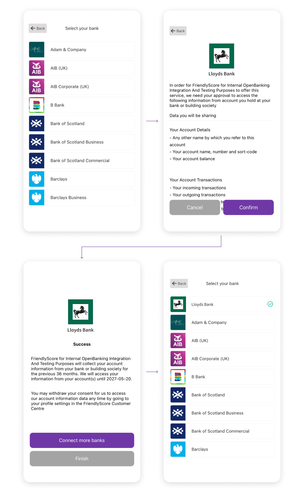

# iOS SDK

## Overview
  <p align="center">
    
  </p>

### Introduction

Here you can find instructions on how to integrate and use FriendlyScore Connect for iOS.

To get started quickly with FriendlyScore Connect for iOS, clone the GitHub repository and run the example. You will need to [sign-up](https://friendlyscore.com/getting-started) for the free API keys through our Developer Console.

### Requirements

- Xcode 10 or greater
- iOS 12.0 or greater
- [FriendlyScore Client Id](https://friendlyscore.com/company/keys)

## Quickstart Demo App

Clone and run the demo project from our [GitHub repository](https://github.com/FriendlyScore/FriendlyScore-Connect-iOS-Example/).

## Installation

FriendlyScore Connect is a framework distributed using [CocoaPods](https://cocoapods.org/) dependency manager. If you are not familiar with this concept, please follow [detailed instructions here](https://guides.cocoapods.org/using/getting-started.html).

To integrate, add `FriendlyScoreConnect` to your `Podfile`

```bash
pod 'FriendlyScoreConnect', '~> 1.0.10'
```

then run following command in your project main directory:
```bash
pod install
```
CocoaPods will install and embed all sources and dependencies into your app.

## Implementation
When `Connect` is available in customer panel, the SDK will populate a grid of banks to enable connecting and data sharing.

### App Delegate

Start with importing `FriendlyScoreCore` and `FriendlyScoreConnect` framework in your App Delegate:

```swift
import FriendlyScoreCore
import FriendlyScoreConnect
```

Then configure `Connect` in `application:didFinishLaunchingWithOptions`:

```swift
func application(_ application: UIApplication, didFinishLaunchingWithOptions launchOptions: [UIApplication.LaunchOptionsKey: Any]?) -> Bool {
    // Override point for customisation after application launch.
    FriendlyScore.configureConnect()
    return true
}
```

In order to handle redirection properly, add line below to `application(_:open:options:) ` function:
```swift
func application(_ app: UIApplication, open url: URL, options: [UIApplicationOpenURLOptionsKey: Any] = [:]) -> Bool {
        FriendlyScore.handleQueryParameters(for: url)
        
        return true
    }
```
### Adding URL Types
Go to the [Redirects](https://friendlyscore.com/company/redirects) section of the FriendlyScore developer console and provide your `Bundle Identifier`.

You will also need your [Client Id](https://friendlyscore.com/company/keys) for the specific environment (SANDBOX, PRODUCTION). 

Navigate to your app target, create new URL Types object and add your bundle identifier to `Identifier` and `URL Schemes` field, as below:

<p align="center">
  
</p>


### UI

Start by importing `FriendlyScoreCore`:

```swift
import FriendlyScoreCore
```

You can select which environment you want to use the FriendlyScore SDK and select the Client Id for that environment

  | Environment |   Description |
  | :----       | :--             |
  | sandbox     | Use this environment to test your integration |
  | production  | Production API environment |

Create the `ClientId` object
```swift
let myClientId = ClientId(stringLiteral: "YOUR_CLIENT_ID")
```
Create the `Credentials` object using `userReference`, which is any alphanumeric string that identifies the user in your systems. It can be used later to access information from the FriendlyScore [API](https://friendlyscore.com/developers) :

```swift
let myCredentials = Credentials(clientId: myClientId, userReference: "YOUR_USER_REFERENCE", environment: .sandbox)
```
Now, using the `myCredentials` object, you can present the `FriendlyScore` SDK anywhere in you code. Usually this can be done after the user's demand, e.g. tapping a button:

```swift
//somewhere in view controller
let button = UIButton(frame: CGRect(x: 0, y: 0, width: 130, height: 45))
button.setTitle("Launch FriendyScore!", for: .normal)
button.addTarget(self, action: #selector(buttonTapHandler), for: .touchUpInside)

self.view.addSubview(button)
```

### Customization

#### Theme
FriendlyScoreConnect can be presented with light (default) or dark theme, with are predefined list of colors and icons.

To use custom colors for the categories, you must override the color keys in your application. Custom theme examples is included in the [custom_theme.json](https://github.com/FriendlyScore/FriendlyScore-Connect-iOS-Example/tree/master/FriendlyScoreConnectDemo/custom_theme.json). The color keys and descriptions are in the `Colors` section.

```
/*
    Optional - Built-in themes = .light, .dark, .custom(themePath: String). Default theme is .light
*/
let connectTheme: ConnectTheme = .light
```

#### Other

```
/*
    Optional - Set a flag whether to display only the back button on the screen with the list of banks. Default is true
*/
let showOnlyBackButtonIcon: Bool = true


/*
    Optional - The label to show on the back button on the view with the list of banks to direct users back to your app. Default label is "Back". Ad
*/
let backButtonLabel: String = "Back"
```
Initiate FriendlyScore View with the options above

```
@objc func buttonTapHandler(button:UIButton) {
    FriendlyScore.show(with: credentials, theme: .light, showOnlyBackButtonIcon: showOnlyBackButtonIcon, backButtonLabel: backButtonLabel)
}
```


### Colors

##### Colors across views
| Color Key                                     |  Description                                                                                  |  
|-----------------------------------            |  ---------------------------------------------------------------------------------------------|                                
| connectBackgroundColor                        |  Background color for all views in the SDK                                                    | 
| connectDividerColor                           |  Divider color for all view in the SDK                                                        |
| connectCancelButtonColor                      |  Background color for Cancel, Disconnect Buttons                                              |
| connectNextButtonColor                        |  Background color for Next, Confirm Button                                                    | 
| connectButtonTextColor                        |  Text color for Buttons                                                                       |
| connectBankDetailMarkerColor                  |  Color for the marker on the detail view for a connected bank                                 |
| connectNavigationButtonBackgroundColor        |  Background color for navigation button in the toolbar                                        | 
| connectNavigationBackButtonItems              |  Color of the back button  for the navigation button                                          |
| connectToolbarIconsColor                      |  Color for the search icon in the toolbar                                                     |
| connectToolbarTextColor                       |  Color for the search field cursor                                                            |
| connectToolbarSearchTextColor                 |  Color for the search text query                                                              | 
| connectToolbarSearchCursorColor               |  Color for the search field cursor                                                            |

##### Colors for List of Bank View
| Color Key                                     |  Description                                                                                  |
|-----------------------------------            |  ---------------------------------------------------------------------------------------------|
| connectBankItemBackgroundColor                |  Background color for bank item in the list of banks                                          |
| connectBankItemTextColor                      |  Text color for bank item in the list of banks                                                | 
| connectBankItemDisabledTextColor              |  Text color for bank item if its disabled or not available in the list of banks               |
| connectBankItemBorderColor                    |  Border color for the bank item in the list of banks                                          |
| connectedBankItemConnectedStatusColor         |  Color of the connected status icon for the bank item in the list of banks                    | 
| connectBankItemUnavailableStatusColor         |  Color of the unavailable status icon for the bank item in the list of banks                  |

##### Colors for Filter
| Color Key                                     |  Description                                                                                  |
|-----------------------------------            |  ---------------------------------------------------------------------------------------------|
| connectFilterHeaderDisabledColor              |  Color for the filter header background color                                                 | 
| connectFilterPageTitleColor                   |  Color for the filter header text color                                                       |
| connectFilterPageSubTitleColor                |  Color for the filter item text color                                                         |


### Events

`FriendlyScore` will populate different events at different stages. To handle events, please implement following:

```swift
FriendlyScore.eventsHandler = { event in
    switch event {
    case .userClosedView:
        print("SDK view closed by user.")
    case .userCompletedFlow:
        print("Friendy Score user completed flow.")
    }
}
```
### Errors

To receive information about errors implement `errorHandler` that throws various `FriendlyScoreError` objects:
```swift
FriendlyScore.errorHandler = { error in
    switch error {
    case .userReferenceAuth:
        print("There was an authentication error for the supplied `userReference`")
    case .server: //unabled to get config
        print("There was a critical error on the server. SDK view closed automatically")
    case .serviceDenied: //wrong client id, access endpoint unpaid
        print("The service you are trying to connect is denied. Reason: \(error.description). SDK view closed automatically")
    }
}
```

## Error Definition
| Error                    | Definitions  | 
| -------------             | -------------|
| userReferenceAuthError   | Present if there was an authentication error for the supplied `userReference`.
| serviceDenied             | Present if service was denied. Please check the description for more information.
| incompleteConfiguration             | Present if the configuration on the server is incomplete. Please check the description for more information.
| serverError               | Present if there was a critical error on the server.      

## Response State Definition
| State                    | Definitions  | 
| -------------             | -------------|
| userClosedView            | Present if the user Closed the FriendlyScore Flow.      
| userCompletedFlow         | Present if the user Completed the FriendlyScore flow.

## Next Steps

### Access to Production Environment

You can continue to integrate FriendlyScore Connect in your app in our sandbox environment. Once you have completed testing, you can access the production environment in the developer console.

### Support 

Find commonly asked questions and answers in our [F.A.Q](https://friendlyscore.com/developers/faq). You can also contact us via email at [developers@friendlyscore.com](mailto:developers@friendlyscore.com) or speak directly with us on LiveChat.

You can find all the code for FriendlyScore Connect for Web component, iOS and Android on our [GitHub](https://github.com/FriendlyScore).
